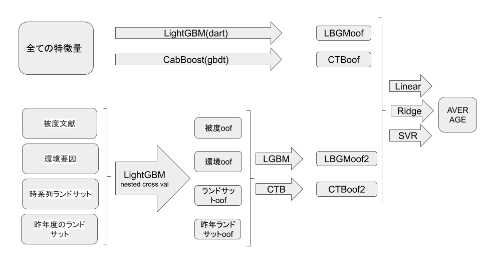

# ブルーカーボン・ダイナミクスを可視化せよ！
#### 沖縄県沿岸の水深・水温等の環境条件のデータから、海草藻場の被度を予測しよう！

# 61th place solution 🥉

[link](https://signate.jp/competitions/936)

## 概要
海草藻場の被度（一定面積の地表面や海底面を覆う割合）を、環境変数や衛星画像をもとに推定する機械学習モデルを開発する

 

### 評価指標
RMSE

 

## やったこと
exp070  
・変数 : 欠損率40%以下のもの　 
・欠損率15%~40%の変数をknnで穴埋め　 
・model : LightGBM  
&emsp; boostying : dart  
&emsp; n_estimators : startが5000で1foldごと+250  
・交差検証 : TimeSplit(n=15)  
・seed average  

 
exp076  
・欠損率15%~40%の変数をknnで穴埋め  
・交差検証 :  
&emsp;TimeSplit(n=15)  
&emsp;nested crossvalidation  
&emsp;&emsp; inner cv : TimeSplit(n=3)  
&emsp;&emsp; outer cv : TimeSplit(n=8)  
・model : LightGBM, CatBoost　 
・stacking : Linear, Ridge, SVR　 
・被度文献、環境要因データ、時系列ランドサット、前年度のランドサット　 

 
 

## 提出
| exp | cv | Public LB | Private LB |
----- | -- | --------- | ----------
70 | 0.1630 | 0.1691 | 0.1787
76 | 0.1234 | 0.1735 | 0.1867

 
 
 

### best submit
| exp | cv | public LB | private LB |
----- | -- | --------- | ----------
75 | 0.2490 | 0.1759 | 0.1595

 
・変数 : 欠損率40%以下のもの  
・欠損率15%~40%の変数をknnで穴埋め  
・model : LightGBM  
・seed avarage  
・交差検証 : 時系列に沿ってクロスバリデーション(学習データの期間の長さをそろえる)  
 

  | fold | train year | valid year |
  ------ | ---------- | ----------
  0 | 1999 ~ 2006 | 2009 
  1 | 2000 ~ 2009 | 2010
  2 | 2001 ~ 2010 | 2011
  3 | 2002 ~ 2011 | 2012
  4 | 2003 ~ 2012 | 2019
  5 | 2006 ~ 2019 | 2020 

